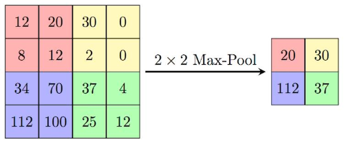

**Workflow:** 

**Workflow**

**Data preprocessing:** 

This step is done in order to make the model learn the features easy and efficient. For preprocessing, data augmentation techniques of rotation and fill mode are used in Image Data Generator. Resizing of the image is done with dimensions as 224 x 224 before sending the image to the model for training and predicting.  

**Configuring ResNet50:** 

CNN works by detecting and extracting features in image by applying filters. The obtained features are then used for class prediction. ResNet50 is one such type of CNN consisting of 50 hidden functional layers like convolution, batch-normalization, global average pooling, flatten and dense. In addition to these layers dropout is also used to avoid overfitting problems. 

**Functional layers used: Convolution**  

   This layer applies 3\*3 filter (also called kernel) to input image of the dataset that end up with activation. Series of activations generate a feature map.  

**Obtaining feature map** 

The input image information is processed in the form of a matrix say 6\*6\*3 and slided over the kernel of size 3\*3\*3 for computing dot product which results in two dimensional output 4\*4. Important point to be noted is filter depth size = number of channels in the input image. The depth of evolved output is determined by number of filters applied. If 32 filters are applied 32 feature maps will be created. 

**Computing dot product** 

**ReLU Activation** 

In the resulted feature map after every convolution, ReLU function is performed to change all negative values of pixel to zero.  

The total number of neurons also called activation size is determined by the formula  

Number of channels\*width of input\*height of input 

The neurons are activated according to certain threshold weight of the image. Those specific set of neurons alone will work leaving other neurons idle. This brings a significant change in computation time. 

**Max Pooling** 

It reduces the dimensionality of the image by extracting only the most important feature (the one with max value in a region). Here a max pool of size 2\*2 is applied after convolution process. 

**Extraction of most important features** 

**Batch Normalization** 

Normalization is one important method which makes it easy for the machine to learn by transforming numerical values to a common scale. Unnormalized values creates commotion for the model to learn. This layer ensures each feature map is normalized to have single mean and standard deviation.  

Data is sent as a batch and so the name batch normalization. Advantage of this layer is that it makes the neural network learn faster by adapting to normalized feature set of images. 

**Dropout** 

If the data is fully taken from previous layer to next layer there arise a issue of model overfitting. The model is highly trained to predict images of the trained dataset but it cannot achieve a generalized pattern of predicting when a image from outside of the trained dataset is passed. To overcome this, we are dropping out some features by dropping out some neurons and making the model to learn by itself. 

**Standard neural net vs dropout applied** 

**Global Average Pooling** 

To avoid overfitting this layer produces only one feature map which contains most important features for each classification category in the last Conv layer. For a tensor with data in the dimension of height \* width \* depth, this layer produces output tensor of 1\*1\*depth dimension. 

**Flatten**  

It converts the feature map output obtained in the form of two dimensional arrays from CNN into one dimensional vector. Dense layer which being a fully connected layer collects the output from this flatten and use it to predict the class. 

**Conversion of feature map into one dimensional vector** 

**Dense** 

Activate the neurons according to the function given and makes each activated neuron to provide one output. Learn features from previous layers as it is fully connected with all layers. 

**Softmax Activation** 

Softmax activation is used at the last output layer to convert number of output units of fully connected layer to class probabilities. Here we have 2 classes 0 for covid and 1 for normal.** 

**Standard ResNet Architecture** 

**Training:** 

The model has been trained for 600 images from 4 different datasets. Adam is used as optimizer and binary cross entropy as loss function. The model is iterated for 100 epochs and 62 steps per epoch with learning rate being 1e-3. Batch size is set to 8. The test dataset is further splitted for cross validation and performance metrics of training and validation are obtained. 

**Testing:**  

In the considered dataset of 600 images the test size is set to 0.2 and for validation the test data is further splitted by setting the size to 0.5. This means 120 images out of 600 will be used for testing. Further out of 120 images, 60 images will be used for validation. 

**Loading model for manual testing and prediction:** 

The saved model file with the file extension .h5 is loaded.        **Preprocessing Input:** 

For manual testing of the desired chest x ray image preprocessing steps of resizing the image to 224\*224 has to be done. Then the image has to be converted to array and the dimensions has to be expanded in order to be sent to the model for prediction. 

`       `**Classification:** 

The  user  loaded  image  will  be  classified  either  as  covid  or  normal  after comparing the image with the features stored in built model. 
8 
